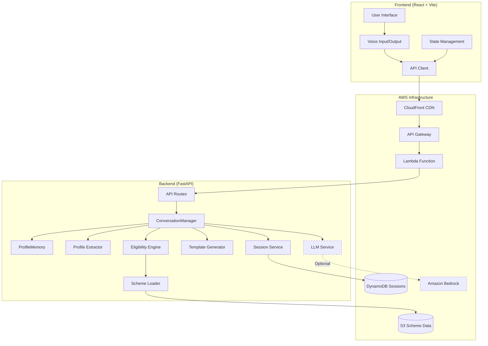
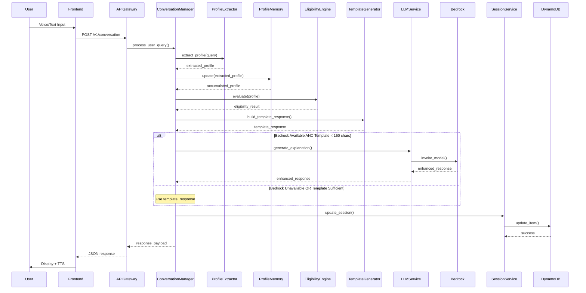
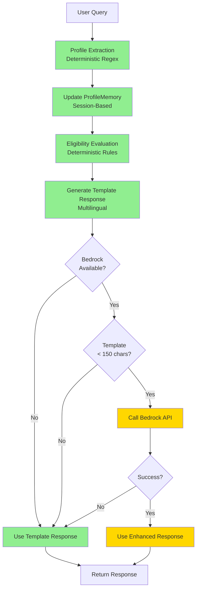

# Design Document: SamvaadAI Platform Stabilization

## Overview

### Purpose

This design document specifies the technical architecture and implementation approach for stabilizing the SamvaadAI platform. The system is a voice-first AI platform that helps rural Indian citizens discover government schemes they're eligible for through natural conversation in English, Hindi, and Marathi.

The stabilization project addresses a critical production readiness gap: the frontend and backend are currently disconnected, and the system must gracefully handle Amazon Bedrock API failures (AccessDeniedException: INVALID_PAYMENT_INSTRUMENT) by falling back to deterministic template-based responses.

### Current State

**Backend (85% Production-Ready)**:
- ConversationManager orchestrates the complete pipeline: Profile Extraction → Memory Update → Eligibility Evaluation → Template Response → Optional LLM Enhancement
- ProfileMemory provides session-based in-memory profile accumulation
- Deterministic profile_extractor uses regex-based extraction (works without LLM)
- Eligibility Engine provides pure rule evaluation with no LLM involvement
- LLM Service integrates with Bedrock with fallback templates
- API endpoints: POST /v1/conversation, POST /v1/session/start

**Frontend (15% Production-Ready)**:
- Visual prototype with ZERO backend integration
- No HTTP client implementation (api.js is stub only)
- Chat component uses hardcoded questions (no backend calls)
- Results component calculates eligibility locally (mock logic)
- Voice pipeline implemented but not connected to backend

**Critical Issue**: Bedrock calls failing with AccessDeniedException requiring graceful degradation to template-based responses.

### Goals

1. **Fix Chat API Wiring**: Connect frontend to backend API endpoints with proper error handling
2. **Implement Smart Profile Memory**: Session-based profile accumulation with 1-hour TTL
3. **Optimize Conversation Pipeline**: Ensure graceful Bedrock fallback with <500ms p95 latency
4. **Create Prototype Scheme Dataset**: 5 government schemes with complete eligibility rules
5. **Implement Voice Assistant UX**: Google Assistant-like voice interactions
6. **Conduct End-to-End Testing**: Comprehensive test scenarios validating all functionality
7. **Perform Engineering Audit**: Quality assessment with prioritized recommendations

### Success Criteria

- API availability: 99% uptime during testing
- Graceful degradation: 100% success rate when Bedrock unavailable
- API latency (p95): <500ms
- Profile extraction accuracy: 90% for test queries
- Eligibility evaluation accuracy: 100% for test profiles
- Test coverage: Minimum 80% code coverage
- Voice recognition success: 80% of inputs correctly transcribed

### Constraints

- System MUST work without Bedrock (graceful degradation mandatory)
- No permanent PII storage (session-only, 1-hour TTL)
- Voice-first design for low-literacy users
- Multilingual support (English, Hindi, Marathi) mandatory
- Deterministic eligibility decisions (AI for language only, never for eligibility)
- Target 5 specific schemes: PM Kisan Samman Nidhi, Ayushman Bharat, PM Awas Yojana, National Scholarship Portal, Pradhan Mantri Mudra Yojana

## Architecture

### High-Level Architecture



### Data Flow: Complete Conversation Turn



### Graceful Degradation Flow



### Component Responsibilities

**Frontend Components**:
- **API Client**: HTTP communication with backend, request/response handling, error management
- **Voice Input/Output**: Web Speech API integration, transcription display, TTS playback
- **State Management**: Session state, conversation history, UI state
- **Scheme Cards**: Display eligible schemes with status, benefits, documents, URLs

**Backend Components**:
- **ConversationManager**: Orchestrates the complete pipeline, coordinates all services
- **ProfileExtractor**: Deterministic regex-based extraction of profile attributes
- **ProfileMemory**: In-memory session-based profile accumulation
- **EligibilityEngine**: Deterministic rule-based eligibility evaluation
- **TemplateGenerator**: Multilingual template response generation
- **LLMService**: Bedrock integration with fallback handling
- **SessionService**: DynamoDB persistence with TTL management
- **SchemeLoader**: S3-based scheme data loading with caching

## Components and Interfaces

### Frontend Components

#### API Client

**Purpose**: Centralized HTTP communication with backend API

**Interface**:
```typescript
interface APIClient {
  // Start a new conversation session
  startSession(): Promise<SessionResponse>
  
  // Send a conversation query
  sendQuery(request: ConversationRequest): Promise<ConversationResponse>
  
  // Health check
  checkHealth(): Promise<HealthResponse>
}

interface ConversationRequest {
  query: string
  language: 'en' | 'hi' | 'mr'
  session_id: string
}

interface ConversationResponse {
  profile: UserProfile
  eligibility: EligibilityResult
  response: string
  schemes: SchemeCard[]
  documents: string[]
  session_id: string
  llm_enhanced: boolean
}

interface SessionResponse {
  session_id: string
  created_at: string
  expires_at: string
}
```

**Implementation Details**:
- Base URL configuration: `localhost:8000` (dev), API Gateway URL (prod)
- Timeout: 10 seconds
- Retry logic: 2 retries with 1-second delay
- Error handling: HTTP status codes (200, 400, 404, 500)
- CORS headers: Automatic inclusion
- Request validation: Non-empty query, valid language code
- Response validation: Schema validation before rendering

#### Voice Input Component

**Purpose**: Capture and transcribe user voice input

**Interface**:
```typescript
interface VoiceInput {
  startListening(): void
  stopListening(): void
  getTranscript(): string
  getConfidence(): number
  isListening(): boolean
}
```

**Implementation Details**:
- Web Speech API: `SpeechRecognition` interface
- Language support: English (en-IN), Hindi (hi-IN), Marathi (mr-IN)
- Continuous mode: Multi-turn conversations
- Auto-stop: 10 seconds of silence
- Confidence threshold: 0.7 minimum
- Fallback: Text input after 3 consecutive failures
- Permissions: Microphone access request with error handling

#### Voice Output Component

**Purpose**: Speak responses using text-to-speech

**Interface**:
```typescript
interface VoiceOutput {
  speak(text: string, language: string): void
  stop(): void
  isSpeaking(): boolean
}
```

**Implementation Details**:
- Web Speech API: `SpeechSynthesis` interface
- Voice selection: Language-appropriate voices
- Rate: 0.9 (slightly slower for clarity)
- Pitch: 1.0 (normal)
- Volume: 1.0 (full)

#### Scheme Card Component

**Purpose**: Display scheme information with eligibility status

**Props**:
```typescript
interface SchemeCardProps {
  id: string
  name: string
  status: 'eligible' | 'partial' | 'ineligible'
  benefit: string
  url: string
  documents: string[]
  lastVerified: string
}
```

**Visual Design**:
- Color coding: Green (eligible), Yellow (partial), Gray (ineligible)
- Status badge: Prominent display at top
- Benefit summary: 2-3 lines with currency formatting
- Document list: Expandable bulleted list
- Official link: Clickable button opening in new tab
- Data freshness: Last verified date indicator
- Responsive: Mobile and desktop layouts

### Backend Components

#### ConversationManager

**Purpose**: Orchestrate the complete conversation pipeline

**Interface**:
```python
class ConversationManager:
    def __init__(
        self,
        gateway: Optional[InferenceGateway] = None,
        evaluate_fn: Optional[Callable[[dict], dict]] = None,
        session_service: Optional[SessionService] = None
    )
    
    def process_user_query(
        self,
        query: str,
        language: str = "en",
        session_id: Optional[str] = None
    ) -> Dict[str, Any]
```

**Pipeline Stages**:
1. Profile extraction (deterministic, always runs)
2. ProfileMemory update (merge with session)
3. Eligibility evaluation (deterministic, always runs)
4. Template response generation (multilingual)
5. Optional LLM enhancement (conditional)
6. History management (MAX_SESSION_MESSAGES guard)
7. Session persistence (DynamoDB)

**Performance Targets**:
- Total latency: <500ms p95 (without Bedrock)
- Total latency: <2000ms p95 (with Bedrock)
- Profile extraction: <100ms
- Eligibility evaluation: <100ms
- Template generation: <50ms

#### ProfileExtractor

**Purpose**: Extract profile attributes using deterministic regex patterns

**Interface**:
```python
def extract_profile(query: str, language: str) -> Dict[str, Any]:
    """
    Returns:
        {
            "profile": {
                "occupation": Optional[str],
                "state": Optional[str],
                "age_group": Optional[str],
                "income_range": Optional[str],
                "gender": Optional[str],
                "disability_status": Optional[str],
                "caste_category": Optional[str],
                "farmer_status": Optional[bool],
                "student_status": Optional[bool]
            },
            "confidence": float
        }
    """
```

**Extraction Patterns**:
- **Occupation**: Keyword matching for farmer, student, teacher, doctor, engineer, business owner, unemployed
- **State**: Keyword matching for all 28 states and 8 union territories (English, Hindi, Marathi names)
- **Age**: Pattern matching for numbers followed by "years", "year", "साल", "वर्ष"
- **Income**: Pattern matching for currency symbols, "lakh", "thousand", "₹"
- **Gender**: Keyword matching for male/female/other in all languages
- **Disability**: Keyword matching for disability-related terms
- **Caste**: Keyword matching for General, OBC, SC, ST
- **Farmer Status**: Boolean based on occupation or explicit mention
- **Student Status**: Boolean based on occupation or explicit mention

**Performance**: <100ms execution time

#### ProfileMemory

**Purpose**: Accumulate profile attributes across conversation turns

**Interface**:
```python
class ProfileMemory:
    def update(self, extracted: Dict[str, Any]) -> Dict[str, Any]
    def get_profile(self) -> Dict[str, Any]
    def get_missing_fields(self) -> List[str]
    def get_populated_fields(self) -> List[str]
    def reset(self) -> None
    
    @property
    def is_complete(self) -> bool
```

**Merge Logic**:
- Non-None values from new extractions overwrite stored values
- Null/None values are ignored (don't overwrite existing data)
- Thread-safe dict operations (GIL-protected)
- No persistence (session-lifetime only)

**Tracked Fields**:
- occupation, state, income_range, age_group, gender
- disability_status, caste_category, farmer_status, student_status
- Legacy fields: age, income (for backward compatibility)

#### EligibilityEngine

**Purpose**: Evaluate profile against scheme eligibility rules

**Interface**:
```python
def evaluate(profile: Dict[str, Any], schemes: List[Dict]) -> Dict[str, Any]:
    """
    Returns:
        {
            "eligible": List[Scheme],
            "partially_eligible": List[Scheme],
            "ineligible": List[Scheme]
        }
    """
```

**Evaluation Logic**:
- Deterministic rule matching (no LLM involvement)
- Supported operators: equals, not_equals, less_than, greater_than, between, in, not_in, contains
- Partial eligibility: Some rules pass, some fail
- Full eligibility: All rules pass
- Ineligible: Most rules fail
- Sorted output: All lists sorted by scheme_id

**Performance**: <100ms for 10 schemes

#### TemplateGenerator

**Purpose**: Generate multilingual template responses

**Interface**:
```python
def build_template_response(
    eligibility: Dict[str, Any],
    missing_fields: List[str],
    language: str
) -> str
```

**Template Types**:
- Welcome message (no profile data)
- Missing information request (incomplete profile)
- Eligible schemes list (with benefits and URLs)
- Partially eligible schemes list (with guidance)
- Ineligible schemes list (with reasons)
- Error message (system failures)

**Language Support**:
- English: Simple, clear language for low-literacy users
- Hindi: Devanagari script with common vocabulary
- Marathi: Devanagari script with regional terms

**Formatting**:
- Currency: Indian numbering system (lakhs, crores)
- Dates: DD/MM/YYYY format
- Lists: Bulleted format with clear hierarchy

**Performance**: <50ms execution time

#### LLMService

**Purpose**: Enhance responses using Amazon Bedrock (optional)

**Interface**:
```python
class InferenceGateway:
    def generate_explanation(
        self,
        eligibility: Dict[str, Any],
        profile: Dict[str, Any],
        query: str,
        language: str
    ) -> str
    
    @property
    def bedrock_available(self) -> bool
```

**Enhancement Conditions**:
- BEDROCK_ENABLED flag is true
- Template response < 150 characters
- Bedrock is available (not marked unavailable)
- Profile has sufficient data (no missing required fields)
- Eligible or partially eligible schemes exist

**Error Handling**:
- AccessDeniedException: Mark Bedrock unavailable, use template
- ThrottlingException: Log warning, use template
- Timeout (3 seconds): Use template
- Any other error: Log error, use template

**Availability Tracking**:
- Module-level flag: `_bedrock_available`
- Mark unavailable after 5 consecutive failures
- Unavailable period: 5 minutes
- Fast-fail: Skip Bedrock calls when marked unavailable

#### SessionService

**Purpose**: Persist session data to DynamoDB with TTL

**Interface**:
```python
class SessionService:
    def create_session(self) -> Dict[str, Any]
    def get_session(self, session_id: str) -> Optional[Dict[str, Any]]
    def update_session(self, session_id: str, updates: Dict[str, Any]) -> Dict[str, Any]
    def delete_session(self, session_id: str) -> None
```

**Session Schema**:
```python
{
    "session_id": str,  # UUID
    "structured_profile": Dict[str, Any],
    "conversation_state": Dict[str, Any],
    "evaluation_result": Optional[Dict[str, Any]],
    "ttl": int,  # Unix timestamp
    "created_at": str,  # ISO 8601
    "updated_at": str   # ISO 8601
}
```

**TTL Management**:
- Default TTL: 3600 seconds (1 hour)
- Auto-refresh: TTL updated on each session update
- Auto-deletion: DynamoDB automatically deletes expired sessions
- No permanent storage: All PII deleted after expiration

#### SchemeLoader

**Purpose**: Load scheme data from S3 with caching

**Interface**:
```python
def load_schemes() -> List[Dict[str, Any]]
```

**Caching Strategy**:
- In-memory cache: Lambda execution lifetime
- Cache TTL: 300 seconds (5 minutes)
- Cold start: Preload during Lambda initialization
- Cache invalidation: Time-based expiration

**Scheme Data Structure**:
```python
{
    "scheme_id": str,
    "scheme_name": str,
    "eligibility_criteria": List[Rule],
    "required_documents": List[str],
    "benefit_summary": str,
    "source_url": str,
    "last_verified_date": str
}
```

**Rule Structure**:
```python
{
    "field": str,
    "operator": str,  # equals, not_equals, less_than, greater_than, between, in, not_in, contains
    "value": Any
}
```

## Data Models

### User Profile

```python
class UserProfile(BaseModel):
    occupation: Optional[str] = None
    state: Optional[str] = None
    income_range: Optional[str] = None  # "0-2L", "2-5L", "5-10L", "10L+"
    age_group: Optional[str] = None  # "18-25", "26-40", "41-60", "60+"
    gender: Optional[str] = None  # "male", "female", "other"
    disability_status: Optional[str] = None  # "none", "physical", "visual", "hearing", "mental"
    caste_category: Optional[str] = None  # "General", "OBC", "SC", "ST"
    farmer_status: Optional[bool] = None
    student_status: Optional[bool] = None
    
    # Legacy fields for backward compatibility
    age: Optional[int] = None
    income: Optional[int] = None
```

### Scheme

```python
class Rule(BaseModel):
    field: str
    operator: str  # equals, not_equals, less_than, greater_than, between, in, not_in, contains
    value: Any

class Scheme(BaseModel):
    scheme_id: str
    scheme_name: str
    eligibility_criteria: List[Rule]
    required_documents: List[str]
    benefit_summary: str
    source_url: str
    last_verified_date: str  # ISO 8601 date
    
    class Config:
        json_schema_extra = {
            "example": {
                "scheme_id": "pm_kisan",
                "scheme_name": "PM Kisan Samman Nidhi",
                "eligibility_criteria": [
                    {"field": "farmer_status", "operator": "equals", "value": True},
                    {"field": "income_range", "operator": "in", "value": ["0-2L", "2-5L"]}
                ],
                "required_documents": [
                    "Aadhaar Card",
                    "Land Ownership Documents",
                    "Bank Account Details"
                ],
                "benefit_summary": "₹6,000 per year in three installments",
                "source_url": "https://pmkisan.gov.in/",
                "last_verified_date": "2024-01-15"
            }
        }
```

### Eligibility Result

```python
class EligibilityResult(BaseModel):
    eligible: List[Scheme]
    partially_eligible: List[Scheme]
    ineligible: List[Scheme]
```

### Session

```python
class Session(BaseModel):
    session_id: str
    structured_profile: UserProfile
    conversation_state: Dict[str, Any]
    evaluation_result: Optional[EligibilityResult]
    ttl: int  # Unix timestamp
    created_at: str  # ISO 8601
    updated_at: str  # ISO 8601
```

### API Request/Response Models

```python
class ConversationRequest(BaseModel):
    query: str = Field(..., min_length=1, max_length=1000)
    language: str = Field(..., pattern="^(en|hi|mr)$")
    session_id: Optional[str] = None

class ConversationResponse(BaseModel):
    profile: UserProfile
    eligibility: EligibilityResult
    response: str
    schemes: List[SchemeCard]
    documents: List[str]
    session_id: str
    llm_enhanced: bool = False

class SchemeCard(BaseModel):
    id: str
    name: str
    status: str  # "eligible", "partial", "ineligible"
    benefit: str
    url: str
    documents: List[str]

class SessionStartResponse(BaseModel):
    session_id: str
    created_at: str
    expires_at: str

class HealthResponse(BaseModel):
    status: str
    version: str
    bedrock_available: bool
```

### Prototype Scheme Dataset

The system will include exactly 5 government schemes with complete eligibility rules:

#### 1. PM Kisan Samman Nidhi

```json
{
  "scheme_id": "pm_kisan",
  "scheme_name": "PM Kisan Samman Nidhi",
  "eligibility_criteria": [
    {"field": "farmer_status", "operator": "equals", "value": true},
    {"field": "income_range", "operator": "in", "value": ["0-2L", "2-5L", "5-10L"]}
  ],
  "required_documents": [
    "Aadhaar Card",
    "Land Ownership Documents",
    "Bank Account Details"
  ],
  "benefit_summary": "₹6,000 per year in three equal installments of ₹2,000 each",
  "source_url": "https://pmkisan.gov.in/",
  "last_verified_date": "2024-01-15"
}
```

#### 2. Ayushman Bharat (PM-JAY)

```json
{
  "scheme_id": "ayushman_bharat",
  "scheme_name": "Ayushman Bharat (PM-JAY)",
  "eligibility_criteria": [
    {"field": "income_range", "operator": "in", "value": ["0-2L", "2-5L"]},
    {"field": "caste_category", "operator": "in", "value": ["SC", "ST", "OBC"]}
  ],
  "required_documents": [
    "Aadhaar Card",
    "Ration Card",
    "Income Certificate"
  ],
  "benefit_summary": "Health insurance coverage up to ₹5,00,000 per family per year",
  "source_url": "https://pmjay.gov.in/",
  "last_verified_date": "2024-01-15"
}
```

#### 3. PM Awas Yojana

```json
{
  "scheme_id": "pm_awas_yojana",
  "scheme_name": "Pradhan Mantri Awas Yojana",
  "eligibility_criteria": [
    {"field": "income_range", "operator": "in", "value": ["0-2L", "2-5L", "5-10L"]},
    {"field": "age_group", "operator": "in", "value": ["18-25", "26-40", "41-60"]}
  ],
  "required_documents": [
    "Aadhaar Card",
    "Income Certificate",
    "Property Documents",
    "Bank Account Details"
  ],
  "benefit_summary": "Subsidy for home construction or purchase, up to ₹2,67,000",
  "source_url": "https://pmaymis.gov.in/",
  "last_verified_date": "2024-01-15"
}
```

#### 4. National Scholarship Portal

```json
{
  "scheme_id": "national_scholarship",
  "scheme_name": "National Scholarship Portal",
  "eligibility_criteria": [
    {"field": "student_status", "operator": "equals", "value": true},
    {"field": "income_range", "operator": "in", "value": ["0-2L", "2-5L"]},
    {"field": "caste_category", "operator": "in", "value": ["SC", "ST", "OBC"]}
  ],
  "required_documents": [
    "Aadhaar Card",
    "Income Certificate",
    "Caste Certificate",
    "Educational Documents",
    "Bank Account Details"
  ],
  "benefit_summary": "Scholarships ranging from ₹10,000 to ₹50,000 per year based on course",
  "source_url": "https://scholarships.gov.in/",
  "last_verified_date": "2024-01-15"
}
```

#### 5. Pradhan Mantri Mudra Yojana

```json
{
  "scheme_id": "pm_mudra_yojana",
  "scheme_name": "Pradhan Mantri Mudra Yojana",
  "eligibility_criteria": [
    {"field": "occupation", "operator": "in", "value": ["business owner", "self-employed"]},
    {"field": "age_group", "operator": "in", "value": ["18-25", "26-40", "41-60"]}
  ],
  "required_documents": [
    "Aadhaar Card",
    "PAN Card",
    "Business Plan",
    "Bank Account Details",
    "Address Proof"
  ],
  "benefit_summary": "Business loans up to ₹10,00,000 with low interest rates",
  "source_url": "https://www.mudra.org.in/",
  "last_verified_date": "2024-01-15"
}
```

## 