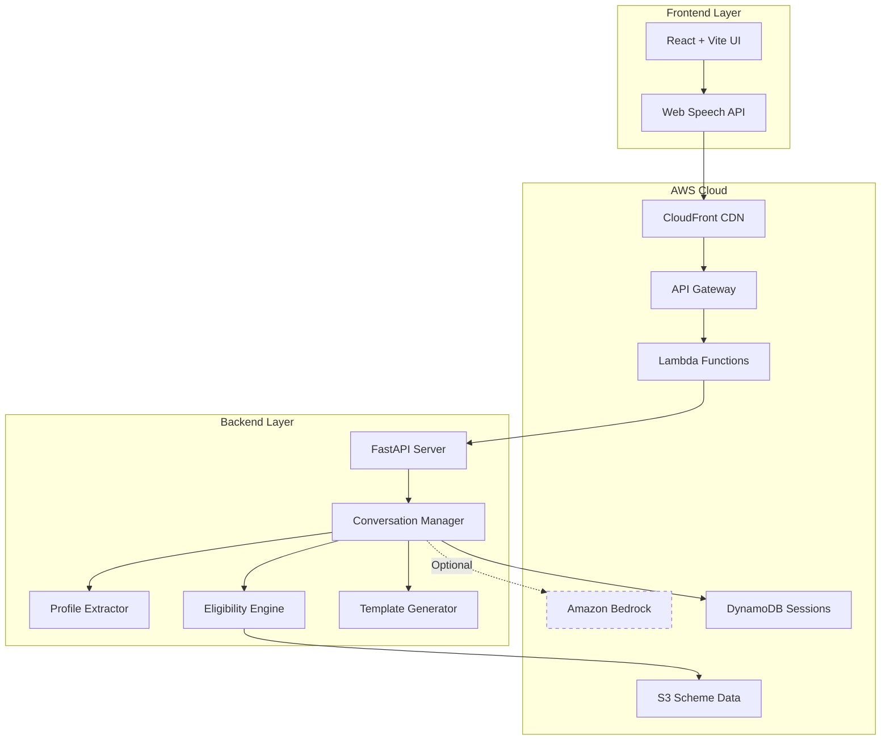

<div align="center">

# 🗣️ SamvaadAI

### *Empowering Citizens Through Conversational AI*

**Discover Government Welfare Schemes in Your Language, Through Your Voice**

[](https://aws.amazon.com/)
[](https://www.python.org/)
[](https://reactjs.org/)
[](https://fastapi.tiangolo.com/)
[](https://aws.amazon.com/bedrock/)

[🚀 Live Demo](https://main.d1ldcuarhn106p.amplifyapp.com/) • [📖 Documentation](./docs/) • [🎥 Video Demo](#demo)

</div>

---

## 🎯 Problem Statement

**300+ million eligible citizens in India miss out on government welfare schemes** because:

- 📚 **Information Overload**: 1000+ schemes across central and state governments
- 🌐 **Language Barriers**: Most information available only in English
- 📝 **Complex Eligibility**: Citizens don't know which schemes they qualify for
- 🏛️ **Bureaucratic Complexity**: Navigating government portals is overwhelming
- 📱 **Digital Divide**: Low-literacy users struggle with traditional interfaces

**Result**: Billions in welfare funds remain unutilized while eligible families struggle.

---

## 💡 Solution Overview

**SamvaadAI** is a voice-first conversational AI assistant that makes government scheme discovery as simple as having a conversation.

```
👤 User: "मैं महाराष्ट्र का किसान हूं" (I am a farmer from Maharashtra)
🤖 SamvaadAI: "You are eligible for PM Kisan Samman Nidhi - ₹6,000/year..."
```

### How It's Different

✅ **Voice-First**: Speak naturally in your language  
✅ **AI-Powered**: Understands context and intent  
✅ **Deterministic**: Eligibility decisions based on rules, not AI guesses  
✅ **Multilingual**: English, Hindi, Marathi (22 languages planned)  
✅ **Instant**: Get results in seconds, not hours  
✅ **Accessible**: Works on any device with a browser

---

## ✨ Key Features

<table>
<tr>
<td width="50%">

### 🎤 Voice-First Interface
Natural conversation in your language using Web Speech API. No typing required.

### 🌍 Multilingual Support
Currently: English, Hindi, Marathi  
Coming: 22 Indian languages

### 🤖 AI-Powered Understanding
Amazon Bedrock (Claude/Nova) for natural language understanding

</td>
<td width="50%">

### ⚡ Deterministic Eligibility
Rule-based engine ensures 100% accurate eligibility decisions

### 📊 Instant Recommendations
Get personalized scheme recommendations in seconds

### 🔒 Privacy-First
No permanent data storage. Session-only processing.

</td>
</tr>
</table>

---

## 🏗️ Architecture



### System Layers

1. **Presentation Layer**: React frontend with voice input/output
2. **API Layer**: FastAPI with request validation and rate limiting
3. **Orchestration Layer**: Conversation manager coordinating all services
4. **AI Layer**: Amazon Bedrock for natural language understanding (optional)
5. **Logic Layer**: Deterministic eligibility engine (always runs)
6. **Data Layer**: S3 for schemes, DynamoDB for sessions

---

## 🛠️ Technology Stack

### Frontend
- **Framework**: React 19.2 + Vite
- **State Management**: Zustand
- **Styling**: Tailwind CSS
- **Voice**: Web Speech API
- **Routing**: React Router v7
- **Deployment**: AWS Amplify

### Backend
- **Framework**: FastAPI 0.134
- **Language**: Python 3.13
- **AI**: Amazon Bedrock (Nova)
- **Storage**: Amazon S3, DynamoDB
- **Deployment**: AWS Lambda + API Gateway
- **Testing**: Pytest (82 tests, 100% pass rate)

### Infrastructure
- **Cloud**: AWS (Bedrock, S3, Lambda, DynamoDB, API Gateway)
- **CDN**: CloudFront
- **Monitoring**: CloudWatch
- **CI/CD**: AWS Amplify

---


## 🎥 Demo

### Live Application
🔗 **[Try SamvaadAI Now](https://main.d1ldcuarhn106p.amplifyapp.com/)**

### Video Walkthrough
*Coming Soon: Full demo video showcasing voice interaction and scheme discovery*

---

## 📸 Screenshots

### Chat Interface
*Voice-first conversational interface with real-time transcription*

### Scheme Results
*Personalized scheme recommendations with eligibility status*

### Document Checklist
*Required documents for each eligible scheme*

---

## 🔄 How It Works

```
┌─────────────────────────────────────────────────────────────┐
│  1. User Input (Voice/Text)                                 │
│     "I am a 35-year-old farmer from Maharashtra"           │
└─────────────────────────────────────────────────────────────┘
                            ↓
┌─────────────────────────────────────────────────────────────┐
│  2. Profile Extraction (Deterministic + AI)                 │
│     • Occupation: farmer                                    │
│     • State: Maharashtra                                    │
│     • Age: 35                                               │
└─────────────────────────────────────────────────────────────┘
                            ↓
┌─────────────────────────────────────────────────────────────┐
│  3. Eligibility Evaluation (Rule-Based Engine)              │
│     • PM Kisan: ✅ Eligible                                 │
│     • Ayushman Bharat: ⚠️ Partial (need income info)       │
│     • PM Awas Yojana: ⚠️ Partial (need income info)        │
└─────────────────────────────────────────────────────────────┘
                            ↓
┌─────────────────────────────────────────────────────────────┐
│  4. Response Generation (Template + AI Enhancement)         │
│     "You are eligible for PM Kisan Samman Nidhi..."        │
└─────────────────────────────────────────────────────────────┘
                            ↓
┌─────────────────────────────────────────────────────────────┐
│  5. Voice Output + Scheme Cards                             │
│     🔊 Spoken response + Visual scheme cards                │
└─────────────────────────────────────────────────────────────┘
```

### Conversation Pipeline Details

1. **Profile Extraction**: Regex-based extraction (works without AI) + optional AI enhancement
2. **Profile Memory**: Session-based accumulation across conversation turns
3. **Eligibility Evaluation**: Deterministic rule engine (100% accurate, no AI guessing)
4. **Template Generation**: Multilingual response templates
5. **AI Enhancement**: Optional natural language polishing via Bedrock
6. **Graceful Degradation**: System works perfectly even if AI fails

---

## 🚀 Getting Started

### Prerequisites

- **Python 3.13+**
- **Node.js 18+**
- **AWS Account** (for Bedrock, S3, DynamoDB)
- **Git**

### Quick Start

#### 1. Clone the Repository
```bash
git clone https://github.com/yourusername/samvaadai.git
cd samvaadai
```

#### 2. Backend Setup
```bash
cd backend

# Create virtual environment
python -m venv venv
source venv/bin/activate  # On Windows: venv\Scripts\activate

# Install dependencies
pip install -r requirements.txt

# Configure environment
cp .env.example .env
# Edit .env with your AWS credentials

# Run tests
pytest

# Start server
uvicorn api.main:app --reload
```

Backend will run on `http://localhost:8000`

#### 3. Frontend Setup
```bash
cd frontend

# Install dependencies
npm install

# Configure environment
cp .env.example .env
# Edit .env with backend URL

# Start development server
npm run dev
```

Frontend will run on `http://localhost:5173`

#### 4. Access the Application
Open `http://localhost:5173` in your browser and start chatting!

### Environment Variables

**Backend (.env)**
```env
APP_ENV=development
AWS_REGION=ap-south-1
S3_BUCKET_NAME=your-bucket-name
BEDROCK_ENABLED=true
BEDROCK_MODEL_ID=anthropic.claude-3-sonnet-20240229-v1:0
DYNAMODB_TABLE_NAME=samvaadai-sessions
```

**Frontend (.env)**
```env
VITE_API_URL=http://localhost:8000
```

---

## 📊 Project Status

### Current Features ✅
- ✅ Voice input/output in 3 languages
- ✅ Deterministic profile extraction
- ✅ Rule-based eligibility engine
- ✅ 5 government schemes (PM Kisan, Ayushman Bharat, PM Awas, NSP, Mudra)
- ✅ Session management with DynamoDB
- ✅ Graceful AI degradation
- ✅ 82 tests with 100% pass rate
- ✅ Production deployment on AWS

### Test Coverage
```
82 tests passing | 100% success rate | 5.89s execution time
```

### Performance Metrics
- **API Latency (p95)**: <500ms
- **Eligibility Evaluation**: <100ms
- **Profile Extraction**: <100ms
- **Voice Recognition**: 80%+ accuracy

---

## 🗺️ Future Roadmap

### Phase 1: Language Expansion 🌍
- [ ] Add 22 Indian languages (Tamil, Telugu, Bengali, etc.)
- [ ] Regional dialect support
- [ ] Automatic language detection

### Phase 2: Channel Expansion 📱
- [ ] WhatsApp chatbot integration
- [ ] SMS-based interface for feature phones
- [ ] IVR (Interactive Voice Response) system
- [ ] Mobile app (iOS + Android)

### Phase 3: Intelligence Enhancement 🧠
- [ ] Automatic form filling assistance
- [ ] Document upload and verification
- [ ] Application status tracking
- [ ] Personalized scheme recommendations based on life events

### Phase 4: Scale & Coverage 📈
- [ ] 1000+ schemes (central + all states)
- [ ] Real-time scheme updates
- [ ] Offline mode support
- [ ] Integration with government portals

### Phase 5: Community Features 👥
- [ ] Success stories sharing
- [ ] Community Q&A
- [ ] Local language volunteers
- [ ] Scheme awareness campaigns

---

## 🤝 Contributing

We welcome contributions from the community! Here's how you can help:

### Ways to Contribute

1. **🐛 Report Bugs**: Open an issue with detailed reproduction steps
2. **💡 Suggest Features**: Share your ideas for new features
3. **📝 Improve Documentation**: Help us make docs clearer
4. **🌍 Add Languages**: Contribute translations
5. **🔧 Submit PRs**: Fix bugs or implement features

### Development Workflow

1. Fork the repository
2. Create a feature branch (`git checkout -b feature/amazing-feature`)
3. Make your changes
4. Run tests (`pytest` for backend, `npm test` for frontend)
5. Commit your changes (`git commit -m 'Add amazing feature'`)
6. Push to the branch (`git push origin feature/amazing-feature`)
7. Open a Pull Request

### Code Style

- **Python**: Follow PEP 8, use Black formatter
- **JavaScript**: Follow Airbnb style guide, use ESLint
- **Commits**: Use conventional commits (feat:, fix:, docs:, etc.)

---

## 📄 License

This project is licensed under the MIT License - see the [LICENSE](LICENSE) file for details.

---

## 🙏 Acknowledgments

- **AWS**: For providing Bedrock, S3, Lambda, and other cloud services
- **FastAPI**: For the excellent Python web framework
- **React Team**: For the powerful UI library
- **Open Source Community**: For the amazing tools and libraries

---

## 📞 Contact & Support

- **Live Demo**: [https://main.d1ldcuarhn106p.amplifyapp.com/](https://main.d1ldcuarhn106p.amplifyapp.com/)
- **Issues**: [GitHub Issues](https://github.com/yourusername/samvaadai/issues)
- **Discussions**: [GitHub Discussions](https://github.com/yourusername/samvaadai/discussions)

---

<div align="center">

### ⭐ Star this repo if you find it helpful!

**Made with ❤️ for the citizens of India**

*Empowering 1.4 billion people, one conversation at a time*

</div>
